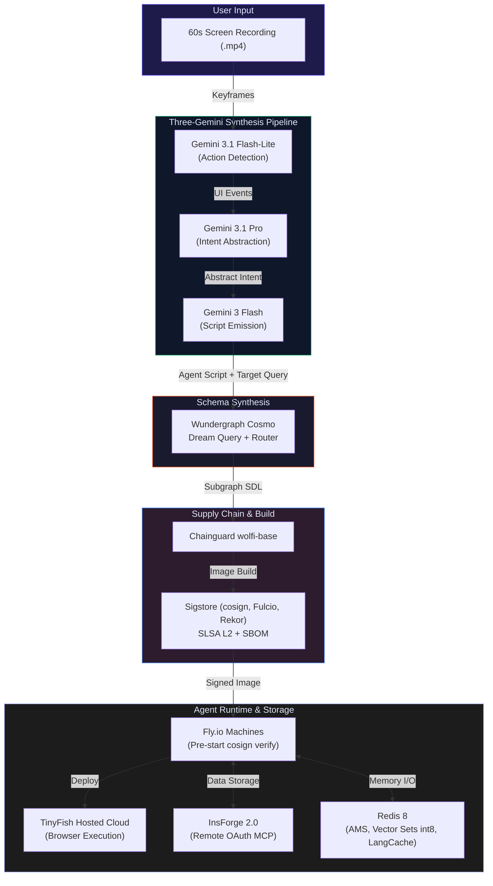
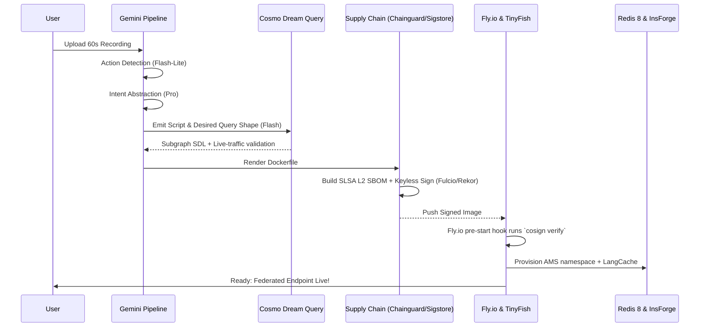

# Understudy

### Record once. Ship a signed agent.

Understudy turns any 60-second screen recording into a signed, production-deployed web agent with a typed federated GraphQL API and persistent memory — no code, no prompts. Show it once, ship it forever.

**Submission for [Ship to Prod — Agentic Engineering Hackathon](https://ship-to-prod.devpost.com/?_gl=1*9v07ap*_gcl_au*MTAwODYwMDg1MS4xNzcwNDIzNzE0*_ga*NzA2NzU0OTgxLjE3NjI2NDc1ODY.*_ga_0YHJK3Y10M*czE3NzcwNzI5MzIkbzM5MSRnMSR0MTc3NzA3MzY5MCRqNTYkbDAkaDA.) | San Francisco, April 2026**

---

## The Problem

**Agent creation for enterprises is heavily bottlenecked.** When a team wants to automate a weekly CSV export or multi-tab reconciliation:

| Pain Point | Impact |
|---|---|
| **High Friction** | Building a web agent takes 1-2 weeks of engineering time even with modern browser-use frameworks. |
| **Missing Primitives** | The bottleneck isn't the model—it's the glue: typed APIs, schema synthesis, and persistent memory are hard to wire up. |
| **Zero Governance** | Enterprises won't run agents that lack a verifiable supply chain or deployment guardrails. |
| **Consumer Focus** | The current agentic space is crowded with chat-based consumer wrappers rather than enterprise-grade pipelines. |

**The result:** Tedious, repetitive workflows remain manual because the overhead of building a secure, governable agent is too high.

---

## The Solution

**Understudy** replaces the entire manual agent-building lifecycle. It acts as a meta-agentic platform that watches you perform a workflow once and synthesizes a production-ready, signed web agent in ~90 seconds.

### The "Record Once" Story

> It's Monday morning. Your ops team needs a weekly script to filter orders and export a CSV from a clunky SaaS dashboard.
>
> You hit record and perform the workflow in your browser for 60 seconds.
>
> Understudy takes the video. A multimodal model detects the exact UI actions. A reasoning model abstracts the intent. A coding model emits a production-ready agent script.
>
> Understudy then dynamically generates the GraphQL schema delta using Cosmo Dream Query and validates it against live traffic. 
> 
> The script is bundled into a Chainguard image, securely signed with a build-time SBOM and an SLSA L2 provenance predicate via Fulcio and Rekor. It deploys to Fly.io, where the pre-start hook cryptographically verifies the signature before booting.
>
> **Total time: ~90 seconds.** Your team now has a federated, signed agent backing a typed API endpoint, complete with Redis memory.

---

## Multimodal Pipeline Showcase

Understudy orchestrates a complex, three-stage AI pipeline and multiple enterprise infrastructure tools to synthesize agents securely:

| Role | Technology | What It Does |
|---|---|---|
| **Action Detection** | Gemini 3.1 Flash-Lite | Extracts 5-8 scene-change keyframes and uses multimodal function responses to detect UI events and clicks (~10× token reduction vs raw video). |
| **Intent Abstraction** | Gemini 3.1 Pro | Uses `thinking_level: high` to lift raw clicks into an abstracted goal, step invariants, and a target I/O schema. |
| **Script Emission** | Gemini 3 Flash | The best coder in the family (78% SWE-bench) emits the target TinyFish script and GraphQL query shape at low latency and cost. |
| **Schema Synthesis** | Wundergraph Cosmo | Dream Query inverts schema design: we pass the desired GraphQL operation, and it emits the SDL delta needed to serve it. |
| **Agentic Runtime** | TinyFish | Executes generated agents on a hosted browser cloud, achieving 2× task completion rates compared to standard MCP setups. |
| **Supply Chain** | Chainguard / Sigstore | Builds `wolfi-base` images with SLSA L2 provenance, signed keyless via cosign + Fulcio, and anchored in Rekor. |
| **Backend & Pool** | InsForge 2.0 | Provides a Remote OAuth MCP backend and warm-pool slot for every generated agent, complete with a Model Gateway for fallback inference. |
| **Agent Memory** | Redis 8 | Powers the Agent Memory Server (AMS), LangCache (semantic response caching), and int8 Vector Sets for per-agent recall. |

---

## Architecture



### Synthesis Core Loop



---

## Creative Sponsor Tool Usage

We explicitly avoided basic "checkbox" integrations. Every tool is load-bearing and creatively deployed to solve a hard enterprise problem:

| Tool | Basic Use (What we DIDN'T do) | Our Creative Use (What we DID) |
|---|---|---|
| **Wundergraph Cosmo** | Merely routing standard GraphQL | **Schema Synthesis Inversion**: Using Dream Query to actively *synthesize* the subgraph SDL from the agent's desired target shape. |
| **Chainguard** | Just using a base image | Implementing a **cryptographic boot refusal** pipeline. Fly.io pre-start hooks verify the SLSA L2 provenance and Rekor inclusion *before* the agent is allowed to boot. |
| **Redis 8** | Simple key-value caching | Implementing **int8 Vector Sets** (saving 75% memory with 99%+ recall) and an **Agent Memory Server** that automatically extracts topics/entities into short and long-term memory streams. |
| **TinyFish** | A simple local browser agent | Compiling the output natively into a **TinyFish CLI script** and executing it strictly on TinyFish's hosted browser cloud, treating the browser as remote infrastructure. |
| **InsForge 2.0** | Basic Postgres queries | Using **Remote OAuth MCP** to entirely bypass stdio friction, plus leveraging the **Model Gateway** as an automatic inference fallback for the Gemini synthesis pipeline. |
| **Gemini 3/3.1** | Passing the entire video to one huge model | A highly optimized **Three-Headed Brain**: Flash-Lite for keyframe actions, Pro for deep intent reasoning, and Flash for SWE-bench-grade script emission. |

---

## Tech Stack

| Component | Technology |
|---|---|
| **API & Orchestration** | Python 3.11, FastAPI |
| **Synthesis Pipeline** | Gemini 3.1 Flash-Lite, Gemini 3.1 Pro, Gemini 3 Flash, `google-genai` |
| **Schema & Federation** | Wundergraph Cosmo, Dream Query, EDFS |
| **Agentic Runtime** | TinyFish CLI, Agent Skills |
| **Supply Chain & Security** | Chainguard `wolfi-base`, cosign, Fulcio, Rekor, SLSA L2 |
| **Backend & Fallback** | InsForge 2.0 Remote OAuth MCP, Model Gateway |
| **Memory & Caching** | Redis 8 (AMS, Vector Sets int8, LangCache) |
| **Deployment** | Fly.io Machines, GitHub Actions |
| **Frontend Dashboard** | TypeScript, Vite, React, shadcn/ui |

---

## Quick Start

### 1. Setup Environment

```bash
git clone https://github.com/nihalnihalani/understudy
cd understudy
cp .env.example .env
```

Fill in your `.env` file with the necessary credentials:
```bash
GEMINI_API_KEY=             # Gemini 3 / 3.1 API key
TINYFISH_API_KEY=           # TinyFish CLI + Agent Skills
INSFORGE_URL=               # InsForge OSS Host
INSFORGE_API_KEY=           # InsForge Bearer token
REDIS_URL=redis://localhost:6379
COSMO_ROUTER_URL=http://localhost:4000
DEMO_MODE=live              # live | replay | hybrid
```

### 2. Install Dependencies

Install the CLI and Python/Node requirements:
```bash
npm install -g @tinyfish/cli
tinyfish skills install web-workflow-pack
make install
```

### 3. Run the Stack Locally

```bash
# Start redis + cosmo-router + insforge stub
make docker-up

# Start the API, Synthesis Worker, and Web UI
make dev
```

### 4. Supply Chain Verification

Verify the signed production image with SLSA L2 provenance locally:
```bash
cosign verify \
  --certificate-identity "https://github.com/nihalnihalani/understudy/.github/workflows/release.yml@refs/heads/main" \
  --certificate-oidc-issuer "https://token.actions.githubusercontent.com" \
  ghcr.io/nihalnihalani/understudy-agent-base:latest

cosign verify-attestation \
  --type slsaprovenance \
  --certificate-identity "..." --certificate-oidc-issuer "..." \
  ghcr.io/nihalnihalani/understudy-agent-base:latest
```

### 5. Trigger a Synthesis

```bash
curl -X POST http://localhost:8080/synthesize \
  -F recording=@fixtures/demo-workflow.mp4
```

---

## License

MIT

---

**Understudy** — Built for the Ship to Prod Agentic Engineering Hackathon in San Francisco, April 2026.
