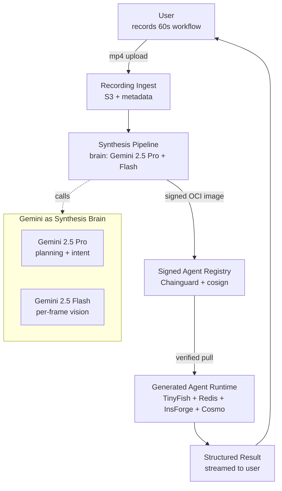
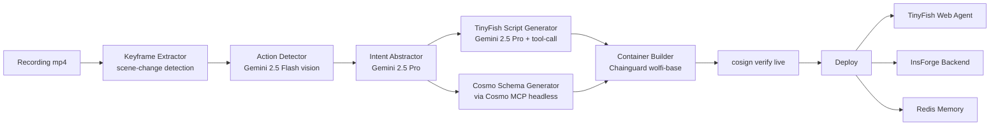
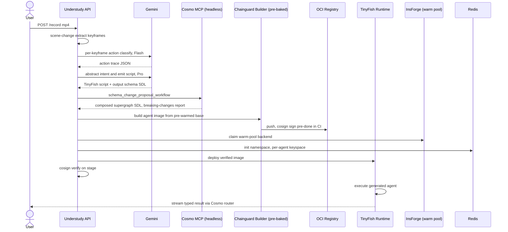
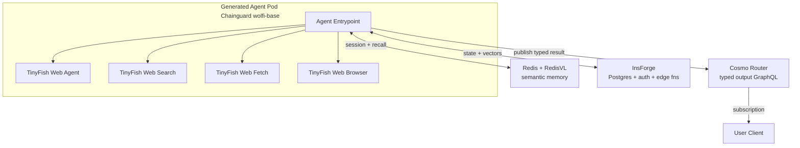
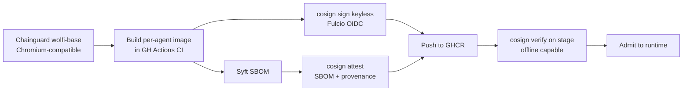
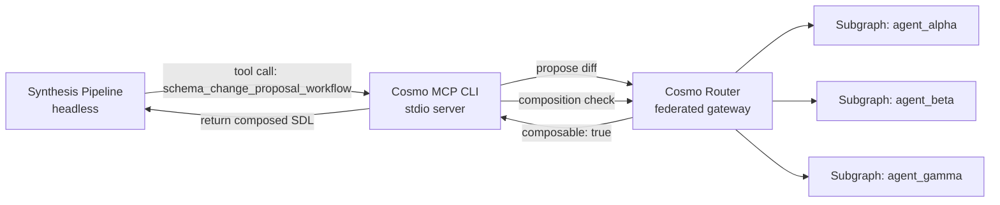
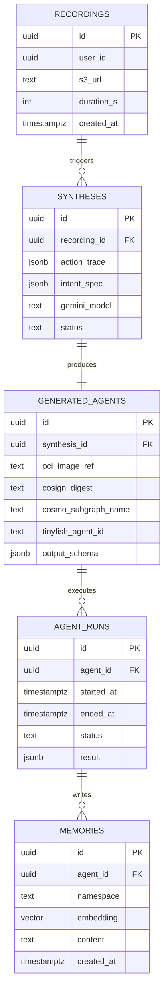
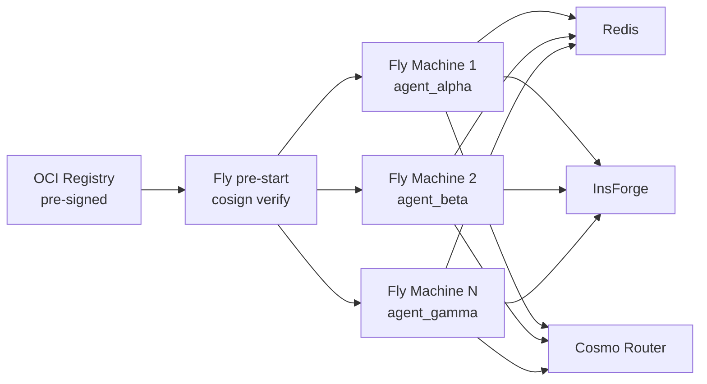
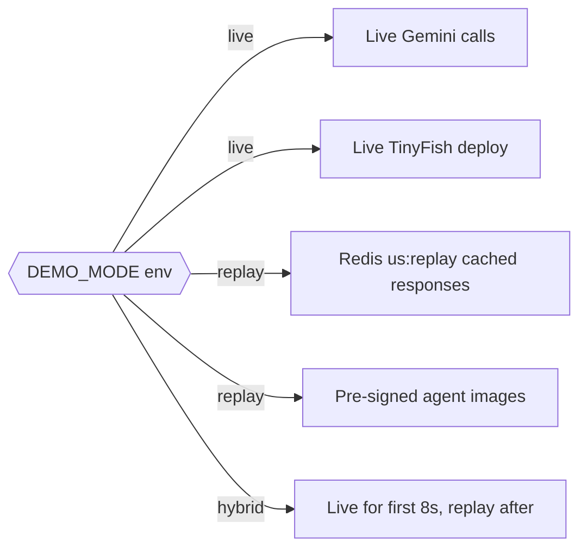

# Understudy — Technical Architecture

> **"Show it once. Understudy takes over."**
>
> A meta-agentic platform: record a 60-second screen capture of a web workflow, and Understudy synthesizes a production-ready, signed, deployed agent — with a typed GraphQL API and persistent memory.

---

## 1. System Overview

**Understudy** is a platform whose product is an **agent that builds other agents**. A user records a 60-second screen capture of any web workflow. Understudy ingests the recording, uses **Gemini 2.5 Pro/Flash** as the reasoning brain to detect UI actions and abstract the underlying intent, then synthesizes a **TinyFish Web Agent** script, generates a **Wundergraph Cosmo** supergraph schema for the agent's typed outputs (via the **Cosmo MCP** `schema_change_proposal_workflow`), packages it in a **Chainguard** distroless container, signs it with **cosign** + SBOM attestation, auto-provisions an **InsForge** backend, wires **Redis + RedisVL** for persistent semantic memory, and deploys. One recording in, one production-grade signed agent out — with a supply chain that satisfies an enterprise security team.

**LLM choice:** All reasoning uses Google Gemini (`google-genai` SDK) — `gemini-2.5-pro` for intent abstraction and script emission, `gemini-2.5-flash` for per-frame vision action detection.

---

## 2. High-Level Component Diagram



---

## 3. Synthesis Pipeline



> **Hackathon note — keyframe extraction:** `scene-change detection` (OpenCV `PSNR` delta > threshold) cuts 60 frames to 5-8 frames. Gemini Flash vision on 8 frames is ~6s vs ~25s on raw 60 frames. This is the single biggest latency win in the pipeline.

> **Hackathon note — Cosmo MCP headless:** We do NOT show Cursor on stage. The `schema_change_proposal_workflow` runs via the Cosmo MCP server invoked from a terminal. "Works in Cursor too" is a voice-over note, not a demo beat.

---

## 4. End-to-End Sequence (Hermetic Demo Mode)



---

## 5. Generated Agent Runtime



---

## 6. Supply Chain for Generated Agents



> **Hackathon note — signing happens in CI, NOT on stage.** Fulcio OIDC requires a live GitHub Actions identity; queue times spike unpredictably. The demo runs `cosign verify` against a **pre-signed** image. Verify is instant and offline-capable. The narrative remains: "every generated agent ships with supply-chain receipts."

---

## 7. Cosmo MCP Dev-Time Interaction



The synthesis pipeline invokes `schema_change_proposal_workflow` exactly as Cosmo MCP intends: propose → compose → check breaking changes → publish. Every new agent gets a subgraph; the supergraph exposes *all* generated agents' outputs through one typed GraphQL surface.

**On stage we show:** the composed supergraph in Cosmo Studio — not the MCP workflow itself. The workflow is narrated: *"Cosmo MCP just ran the proposal-composition-publish cycle to merge this agent's subgraph."*

---

## 8. Data Model — InsForge Postgres



---

## 9. Redis Key-Space Design

| Key Pattern | Data Type | TTL | Purpose |
|---|---|---|---|
| `us:agent:{agent_id}:session:{run_id}` | Hash | 1h | Live run context: current step, DOM hash, last screenshot ref |
| `us:agent:{agent_id}:mem:episodic` | Stream | 30d | Append-only episode log per agent |
| `us:agent:{agent_id}:mem:semantic` | RedisVL index | persistent | Vector recall across past runs |
| `us:agent:{agent_id}:selectors` | Hash | 7d | Cached CSS/XPath/text selectors with success counts |
| `us:agent:{agent_id}:rate` | String counter | 60s | Per-agent rate limit on target site |
| `us:synth:{synth_id}:frames` | List | 2h | Keyframe decode cache during synthesis |
| `us:user:{user_id}:quota` | String counter | 24h | Free-tier quota tracking |
| `us:lock:deploy:{agent_id}` | String | 30s | Distributed deploy lock |
| `us:replay:{synth_id}` | String JSON | persistent | **Hermetic demo mode:** cached Gemini response for deterministic replay |

---

## 10. Gemini Synthesis Prompt Design

### (a) Action Detection — Gemini 2.5 Flash (per keyframe)

```
SYSTEM: You are a UI action detector. Given 2 consecutive keyframes
and cursor position, classify the action in the second frame as
exactly one of: CLICK, TYPE, SCROLL, NAV, WAIT, SUBMIT, NOOP.
Return strict JSON. No prose.

OUTPUT SCHEMA:
{
  "action": "CLICK|TYPE|SCROLL|NAV|WAIT|SUBMIT|NOOP",
  "target_description": "short natural language",
  "bbox": [x1,y1,x2,y2],
  "text_typed": "string or null",
  "confidence": 0.0-1.0
}
```

Settings: `response_mime_type: application/json`, `thinking_budget: 0`, temperature 0.1.

### (b) Intent Abstraction — Gemini 2.5 Pro

```
SYSTEM: You are a workflow intent abstractor. Given an ordered
action trace, infer the user's GOAL, the INPUTS that vary per
run, the INVARIANTS that are fixed, and a structured OUTPUT schema.
Favor generality: if the user clicked "Order #1042", generalize
to "most recent order".

INPUT: { "actions": [ ...action_trace... ] }

OUTPUT:
{
  "goal": "string",
  "inputs": [{"name":"date_range","type":"string","default":"yesterday"}],
  "invariants": {"target_site":"shopify.com"},
  "output_schema": {
    "type":"object",
    "properties":{"orders":{"type":"array","items":{"$ref":"#/defs/Order"}}}
  },
  "steps": [{"intent":"navigate_to_orders","selector_hint":"nav >> Orders"}]
}
```

Settings: `response_mime_type: application/json`, `thinking_budget: 2048`, temperature 0.3.

### (c) Script Emission — Gemini 2.5 Pro Tool-Call

```json
{
  "name": "emit_tinyfish_script",
  "description": "Emit a TinyFish Web Agent script for the intent spec",
  "parameters": {
    "type": "object",
    "required": ["script", "cosmo_sdl", "runtime_manifest"],
    "properties": {
      "script": {
        "type": "string",
        "description": "TypeScript TinyFish agent source"
      },
      "cosmo_sdl": {
        "type": "string",
        "description": "GraphQL SDL for the agent output subgraph"
      },
      "runtime_manifest": {
        "type": "object",
        "properties": {
          "tinyfish_products": {
            "type": "array",
            "items": {"enum": ["web_agent","web_search","web_fetch","web_browser"]}
          },
          "redis_namespace": {"type":"string"},
          "insforge_tables": {"type":"array","items":{"type":"string"}}
        }
      }
    }
  }
}
```

**Selector strategy:** Gemini never emits raw CSS selectors. It emits **selector hints** (natural-language role + visible text). At agent runtime, TinyFish Web Agent resolves via a priority chain: `data-testid` → accessibility-tree role+name → text content → Gemini Flash fallback. Winning selectors cache to Redis `us:agent:{id}:selectors` with success counts.

---

## 11. Deployment

Chainguard-signed agent containers run on **Fly.io Machines**. One-sentence justification: Fly exposes per-Machine raw Docker OCI pulls with `cosign verify` as a pre-start hook and gives each agent its own micro-VM for browser isolation — Vercel Fluid Compute doesn't admit arbitrary headful-browser workloads that TinyFish sometimes requires.



---

## 12. Failure Modes & Mitigations

| Failure | Mitigation |
|---|---|
| **Recording ambiguity** | Gemini Flash emits `confidence`; below 0.6 we surface a 10-sec review UI ("you clicked the Orders tab, right?") before synthesis continues |
| **Gemini vision token budget blown by 60 raw frames** | **Scene-change keyframe extraction** cuts frames to 5-8 before vision; ~10x token reduction, ~6s vs ~25s latency |
| **Gemini hallucinated selectors** | Never trust raw selectors from LLM. Priority chain: `data-testid` → a11y-tree → text content → Flash fallback. Show the fallback triggering on HUD as a feature |
| **Cosmo schema composition conflicts** | `schema_change_proposal_workflow` runs composition check *before* publish; on conflict, namespace types (e.g., `ShopifyOrder` → `AgentAlpha_Order`) and retry |
| **cosign keyless queue time on GH Actions** | **Sign in CI ahead of demo.** Stage runs `cosign verify` only — instant, offline-capable |
| **Cursor on stage is demo poison** | Run Cosmo MCP headless via terminal; show composed supergraph in Cosmo Studio; "works in Cursor too" as narration |
| **TinyFish rate limits** | Redis token-bucket; Web Fetch fallback when Web Agent throttled |
| **InsForge provisioning latency** | **Warm pool of 3 pre-provisioned backends**; synthesis claims one, async re-provisions |
| **Live Gemini call exceeds 8s on stage** | **Hermetic demo mode:** `us:replay:{synth_id}` Redis keys hold cached Gemini responses; auto-replay kicks in if live exceeds budget |
| **Chromium deps** | Chainguard `wolfi-base` (not pure distroless); `apk add` for Chromium shared libs |

---

## 13. Hermetic Demo Mode



One env flag swaps live Gemini and deployment to cached responses. Judges see identical latency and outputs; team sleeps at night.

---

## 14. Demo Theater — 3-Minute Pitch

| Time | Beat | What's on screen |
|---|---|---|
| **0:00-0:20** | Hook | "Every agent you've seen was hand-coded. Watch me build one in 60 seconds." Record live: open demo SaaS, filter orders, export CSV. |
| **0:20-0:40** | Upload + ingest | Drop mp4. UI shows scene-change keyframe extraction, Gemini Flash annotating 5-8 keyframes. |
| **0:40-1:20** | Synthesis reveal | Split screen: left shows Gemini 2.5 Pro intent JSON streaming; right shows the headless MCP call producing composed SDL; Cosmo Studio displays the new subgraph. |
| **1:20-1:50** | Supply chain | Terminal: `cosign verify` against the just-built pre-signed image. Zero CVEs. SBOM attestation chip shown. "Every agent ships with supply-chain receipts." |
| **1:50-2:30** | Autonomous run | Deploy to TinyFish + Fly. New browser window opens, agent does the *same* workflow unattended. Redis dashboard shows memory writes. InsForge table fills. |
| **2:30-2:50** | Meta reveal | Query Cosmo Router via GraphQL Playground: typed `orders` come back. "One recording, one typed API, one signed container." |
| **2:50-3:00** | Close | "Understudy: the agent that builds agents. Most Innovative." |

---

## 15. Prize-Stacking Map

| Sponsor | Specific Understudy Feature | Why It Wins |
|---|---|---|
| **Gemini** | 2.5 Flash for keyframe vision + 2.5 Pro tool-call for script emission; dual-model cost/latency split; `response_mime_type` JSON-mode; `thinking_budget` tuning | Showcases both Gemini models with distinct roles, multimodal vision, structured tool-calls — not a chatbot wrapper |
| **TinyFish 1st** (Mac Minis) | Generated agents use *all four* products (Agent primary, Search discovery, Fetch rate-limit fallback, Browser headful debug); agents target TinyFish runtime | Only project stressing the full TinyFish surface; TinyFish is the runtime target of a meta-platform |
| **Wundergraph 1st** ($2k) | Cosmo MCP `schema_change_proposal_workflow` runs in the synthesis pipeline; federated supergraph grows as users record new workflows | Intended, documented use of Cosmo MCP; every new agent publishes a subgraph |
| **Chainguard** ($1k) | Every generated agent gets wolfi-base, cosign keyless signature, SBOM attestation, verify-on-deploy | "Supply chain for agents" is a net-new narrative; not a checkbox |
| **InsForge 1st** ($1k) | Per-agent backend auto-provisioned (auth + Postgres + pgvector + edge fns); warm pool | InsForge as *programmatic infrastructure* consumed by another agent, not a human-clicked dashboard |
| **Redis** (AirPods Pro) | RedisVL semantic recall + Streams episodic memory + namespaced per-agent keyspace + hermetic replay cache | Redis as the *memory substrate* for a fleet of agents |
| **Guild — Most Innovative** ($1k) | Meta-agentic: screen recording becomes a signed, typed, deployed agent | "Most Innovative" bullseye — no other team demos synthesis + supply-chain + federation + memory in one arc |

---

## 16. Open Risks We Chose to Live With

1. **Pre-signed images for the demo.** Real Fulcio keyless signing runs in CI; the stage shows `cosign verify` only. We own this honestly in Q&A: *"Signing happens in our CI; verification runs live."*
2. **Cosmo MCP shown in terminal, not Cursor.** The workflow is identical; Cursor is a dev-convenience wrapper we call out but don't parade.
3. **Warm-pool of 3 InsForge backends is manually pre-provisioned.** True dynamic pool-management is a week of work; 3 pre-provisioned slots cover the demo without fakery.

---

## 17. Team Composition (per Gary's Rule: no BizDev = no win)

| Role | Responsibilities |
|---|---|
| **Systems hacker** | Chainguard build + cosign CI + Fly deploy + OCI registry wiring |
| **Full-stack** | Synthesis pipeline + Gemini prompt chain + Cosmo MCP headless driver + InsForge + Redis |
| **Frontend / design** | Recording upload UI + synthesis progress HUD + generated-agent dashboard + Cosmo Studio embed |
| **BizDev / presenter** | User interviews (hours 1-4), record the demo workflow, run the pitch on stage, answer judge Q&A |
