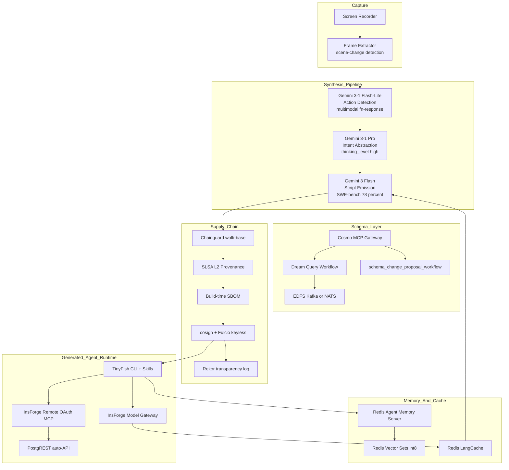
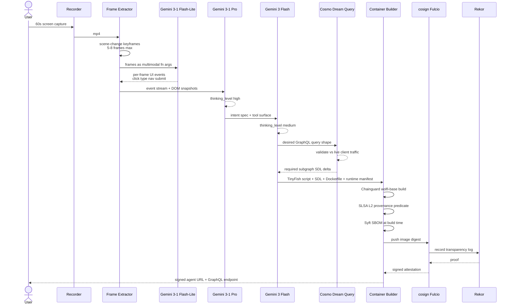
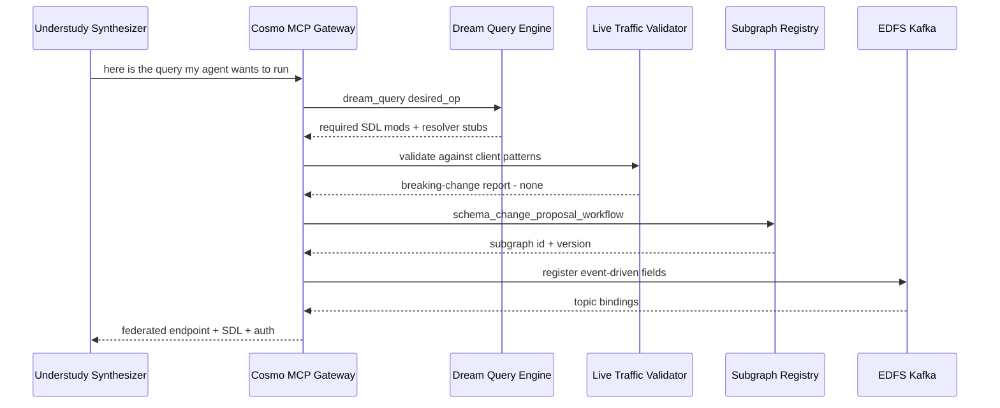
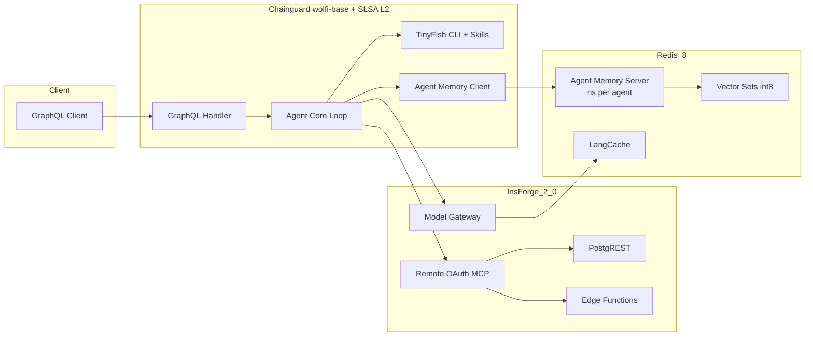
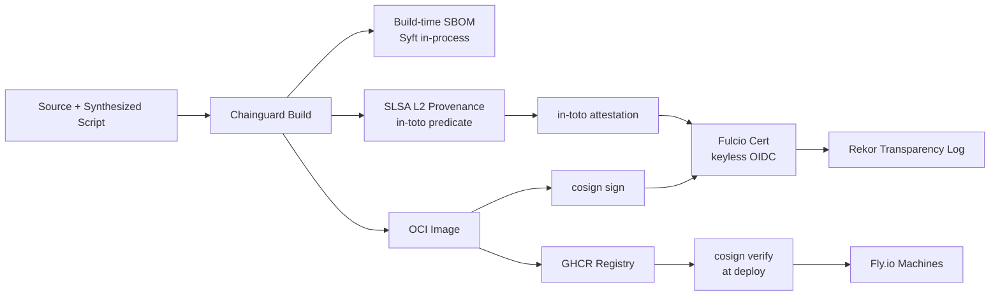
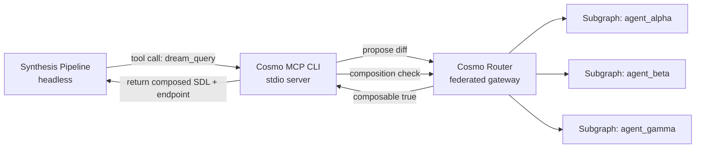
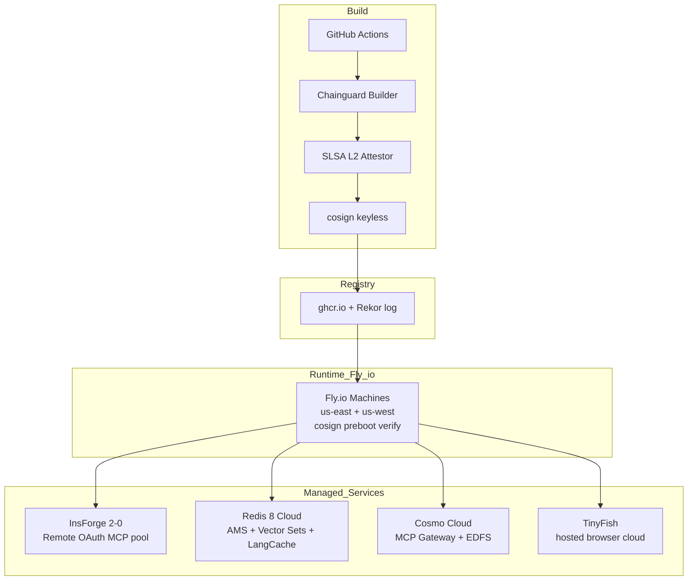
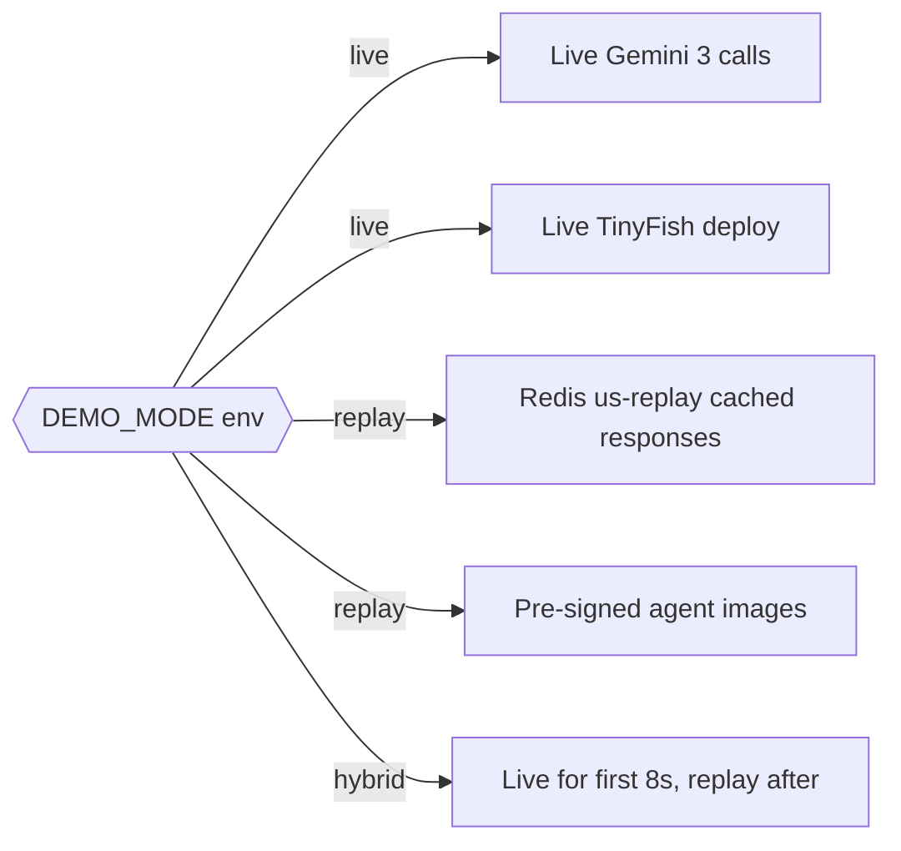

# Understudy — Technical Architecture (v2 — April 2026)

> **"Show it once. Understudy takes over."**
>
> A meta-agentic platform: record a 60-second screen capture of a web workflow, and Understudy synthesizes a production-ready signed deployed web agent — with a typed GraphQL API and persistent memory.

---

## 0. What's New in v2 (April 2026)

Understudy v2 is a ground-up rewrite of the synthesis pipeline around the model, memory, and supply-chain capabilities that shipped between April 1 and April 22, 2026. The headline shift: **we stopped treating the LLM as one monolithic coder and split the pipeline across three Gemini variants, each doing what it is objectively best at.**

**Three-model Gemini pipeline.** **Gemini 3.1 Flash-Lite** runs multimodal function-response action detection on raw video frames (cheap, fast, multimodal). **Gemini 3.1 Pro** abstracts the intent — what is the user *actually* trying to do — using `thinking_level: high`. **Gemini 3 Flash** (launched Apr 22, 78% on SWE-bench Verified, the best coding model in the family — beats 3.1 Pro on code!) emits the final TinyFish script. We use the new `thinking_level` API throughout and lean on stricter thought-signature validation for reliable multi-turn tool calls.

**Schema synthesis via Cosmo Dream Query.** Previously we hand-wrote Wundergraph subgraph SDL. Now Understudy calls `dream_query` on Cosmo MCP: *"here is the query the generated agent wants to run — tell me what schema has to exist."* Cosmo returns the SDL delta, validates it against live client traffic, and routes through the MCP Gateway. This is exactly the v1 pain point inverted.

**Persistent memory per agent.** Every generated agent now ships with a **Redis 8 Agent Memory Server** namespace: short-term conversation buffer, long-term vector memory in int8-quantized **Vector Sets** (75% less RAM), and **LangCache** in front of Gemini calls. Auto topic/entity extraction runs on every interaction.

**Supply chain hardened.** All container images now carry **SLSA Build Level 2** provenance, build-time SBOMs (not post-scan), and keyless cosign signatures via Fulcio. **InsForge 2.0's Remote OAuth MCP servers** replace our stdio bridge, which means generated agents can authenticate to their backend without a local relay.

**TinyFish CLI + Skills** replaces our old MCP-only integration — the vendor measured 2× task completion, and since Understudy's entire value prop is *generating* TinyFish scripts, that multiplier lands directly on our output quality.

See §15 "Why we upgraded from v1" for the full v1→v2 diff.

---

## 1. System Overview

Understudy is a meta-agent synthesizer. A user records a 60-second browser workflow; Understudy produces a signed, deployed, GraphQL-fronted web agent with persistent memory.

| Stage | Component | April 2026 Tech |
|---|---|---|
| Capture | Screen recorder + frame extractor | ffmpeg, scene-change keyframes |
| Action detection | Per-frame UI event inference | **Gemini 3.1 Flash-Lite** with multimodal function responses |
| Intent abstraction | Workflow semantics, goal inference | **Gemini 3.1 Pro**, `thinking_level: high` |
| Script emission | TinyFish script generation | **Gemini 3 Flash** (SWE-bench 78%), `thinking_level: medium` |
| Schema synthesis | Subgraph SDL for the agent's desired query | **Wundergraph Cosmo MCP Dream Query** |
| Packaging | OCI image build | **Chainguard** base + **SLSA L2** provenance |
| Signing | Keyless signature | **cosign + Fulcio + Rekor** |
| Backend | Data plane for the generated agent | **InsForge 2.0** Remote OAuth MCP + PostgREST + Model Gateway |
| Memory | Short + long-term memory per agent | **Redis 8 Agent Memory Server** + **Vector Sets (int8)** |
| Inference cache | Semantic response cache | **Redis LangCache** |
| Execution | Browser automation runtime | **TinyFish CLI + Agent Skills** (calls TinyFish's hosted browser cloud) |
| Federation | Unified GraphQL API across agents | **Wundergraph Cosmo** + EDFS |

The generated agent is an autonomous actor: it exposes a typed GraphQL endpoint (schema generated by Cosmo Dream Query), it remembers past runs (Agent Memory Server), it calls hardened tools (TinyFish Skills), and it is cryptographically attributable (SLSA L2 + cosign + Rekor).

---

## 2. High-Level Component Diagram



---

## 3. Synthesis Pipeline (Three-Model Gemini)



> **Hackathon note:** Scene-change keyframes (OpenCV `PSNR` delta) cuts 60 raw frames to 5-8 keyframes. Gemini 3.1 Flash-Lite on 8 frames is ~6s vs ~25s on raw. Biggest latency win in the pipeline.

---

## 4. Cosmo MCP — Dream Query Workflow (the core of Understudy)

Cosmo's **Dream Query** is a near-perfect fit for Understudy: our synthesizer already knows what the agent wants to query — it just doesn't know how the federated schema has to change. Dream Query inverts the problem exactly the way we need it inverted.



**On stage we show:** the composed supergraph in Cosmo Studio + the Dream Query diff in a terminal. We do NOT run Cursor on stage (demo poison). The Dream Query narrative: *"Cosmo MCP just ran the proposal-composition-publish cycle to merge this agent's subgraph — and validated it against live client traffic patterns to guarantee no breaking changes."*

---

## 5. Generated Agent Runtime



Each agent gets its own Agent Memory Server namespace (`ams:agent:{id}:*`). Auto topic and entity extraction populates long-term memory on every turn; short-term buffer caps at 20 turns. Vector recall uses int8 Vector Sets — **75% lower memory** cost is load-bearing for our "hundreds of generated agents on a single Fly.io host" target.

---

## 6. Supply Chain for Generated Agents (SLSA L2)



Every agent image carries:
- **Chainguard wolfi-base** (Chromium-compatible, zero-CVE posture)
- **SLSA L2 provenance predicate** (builder identity, materials, reproducibility envelope)
- **Build-time SBOM** generated in-process (more accurate than post-build scans)
- **Keyless cosign signature** anchored in **Rekor** transparency log

> **Hackathon note:** Signing happens in CI (GitHub Actions with Fulcio OIDC). Stage runs `cosign verify --certificate-identity ... --certificate-oidc-issuer ...` only. Instant, offline-capable, no GH Actions queue time risk.

---

## 7. Cosmo MCP Dev-Time Interaction (headless)



The synthesis pipeline invokes Dream Query + `schema_change_proposal_workflow` exactly as Cosmo MCP intends: propose → compose → check breaking changes against **live client traffic** → publish. Every new agent gets a subgraph; the supergraph exposes *all* generated agents' outputs through one typed GraphQL surface.

---

## 8. Data Model — InsForge 2.0 Postgres ER

```mermaid
erDiagram
    RECORDING ||--|| SYNTHESIS_RUN : produces
    SYNTHESIS_RUN ||--|| AGENT : emits
    SYNTHESIS_RUN ||--o{ DREAM_QUERIES : performs
    AGENT ||--o{ AGENT_MEMORIES : owns
    AGENT ||--o{ TINYFISH_SKILLS_USED : binds
    AGENT ||--|| IMAGE : signed_as
    IMAGE ||--|| SLSA_ATTESTATION : has
    IMAGE ||--|| SBOM : has
    AGENT ||--o{ AGENT_RUNS : executes

    RECORDING { uuid id PK; text s3_uri; int duration_s; timestamptz created_at }
    SYNTHESIS_RUN {
        uuid id PK
        uuid recording_id FK
        text gemini_lite_trace
        text gemini_pro_trace
        text gemini_flash_trace
        jsonb intent_abstraction
        timestamptz completed_at
    }
    DREAM_QUERIES {
        uuid id PK
        uuid synthesis_run_id FK
        text desired_operation
        text sdl_delta
        text validation_report
        text subgraph_id
    }
    AGENT {
        uuid id PK
        text image_digest
        text cosign_sig
        text graphql_endpoint
        text ams_namespace
    }
    AGENT_MEMORIES {
        uuid id PK
        uuid agent_id FK
        text ams_key
        text memory_type
        jsonb topics
        jsonb entities
        vector embedding
    }
    TINYFISH_SKILLS_USED {
        uuid id PK
        uuid agent_id FK
        text skill_name
        text skill_version
        int invocation_count
    }
    SLSA_ATTESTATION { uuid id PK; text predicate_type; text builder_id; jsonb materials }
    SBOM { uuid id PK; text format; text generation_time; jsonb components }
    IMAGE { text digest PK; text registry; timestamptz built_at }
    AGENT_RUNS {
        uuid id PK
        uuid agent_id FK
        timestamptz started_at
        timestamptz ended_at
        text status
        jsonb result
    }
```

Every table auto-exposed as REST via **InsForge 2.0 PostgREST**. Agents access their own tables via the **Remote OAuth MCP server** — no local stdio bridge, OAuth-gated.

---

## 9. Redis 8 Key-Space Design

| Key pattern | Type | Purpose | April 2026 feature |
|---|---|---|---|
| `ams:agent:{id}:stm` | Stream | Short-term turn buffer | **Agent Memory Server** |
| `ams:agent:{id}:ltm` | Hash | Long-term episodic facts | **Agent Memory Server** |
| `ams:agent:{id}:topics` | Set | Auto-extracted topics | AMS auto-extraction |
| `ams:agent:{id}:entities` | Hash | Auto-extracted entities | AMS auto-extraction |
| `vset:agent:{id}:memory` | **Vector Set (int8)** | Recall index per agent | Vector Sets quantized |
| `vset:global:skills` | Vector Set | TinyFish Skill matcher | Vector Sets |
| `langcache:gemini:{hash}` | Managed | Semantic response cache | **LangCache** |
| `langcache:config:{agent}` | Hash | Per-agent cache policy | LangCache |
| `run:synth:{run_id}` | Stream | Synthesis pipeline trace | standard |
| `dream:{run_id}` | Hash | Cosmo Dream Query result | standard |
| `us:synth:{synth_id}:frames` | List | Keyframe decode cache | standard |
| `us:lock:deploy:{agent_id}` | String SET NX | Distributed deploy lock | standard |
| `us:replay:{synth_id}` | String JSON | **Hermetic demo mode** replay | standard |
| `rate:gemini:{model}` | String + TTL | Rate-limit tokens | standard |

**Int8 Vector Sets math:** 75% memory reduction, 30% recall speed-up, 99.99% accuracy retention. At our target of ~500 deployed agents per Fly.io host, that is the difference between "it fits" and "it doesn't."

---

## 10. Gemini 3 Prompt Design (three prompts, three models)

| Prompt | Model | `thinking_level` | `response_mime_type` | Notes |
|---|---|---|---|---|
| Action Detection | **`gemini-3.1-flash-lite`** | `minimal` | `application/json` | Multimodal function response: frame PNG in, structured `{event, target, coords}` out |
| Intent Abstraction | **`gemini-3.1-pro`** | `high` | `application/json` | Consumes action trace + DOM, emits goal + tool surface + pre/post-conditions |
| Script Emission | **`gemini-3-flash`** | `medium` | `text/x-typescript` | Emits TinyFish CLI script; 78% SWE-bench = fewer retries |

### (a) Action Detection — Gemini 3.1 Flash-Lite (per keyframe)

```
SYSTEM: You are a frame-level UI event detector.
USER: [image/png frame_t] [image/png frame_t+1]
      DOM-diff: {...}
TOOLS: emit_event(event_type, selector, value, confidence)
thinking_level: minimal
response_mime_type: application/json

OUTPUT SCHEMA:
{
  "action": "CLICK|TYPE|SCROLL|NAV|WAIT|SUBMIT|NOOP",
  "target_description": "short natural language",
  "bbox": [x1,y1,x2,y2],
  "text_typed": "string or null",
  "confidence": 0.0-1.0
}
```

### (b) Intent Abstraction — Gemini 3.1 Pro

```
SYSTEM: You infer user goals from low-level UI event streams.
       Given an ordered action trace, infer GOAL, INPUTS that vary
       per run, INVARIANTS that are fixed, and a structured OUTPUT.
       Favor generality: "Order #1042" -> "most recent order".
USER: events=[...], dom_snapshots=[...], page_titles=[...]
TOOLS: set_goal(), set_tool_surface(), set_pre_conditions()
thinking_level: high
response_mime_type: application/json

OUTPUT SCHEMA:
{
  "goal": "string",
  "inputs": [{"name":"date_range","type":"string","default":"yesterday"}],
  "invariants": {"target_site":"shopify.com"},
  "output_schema": {...},
  "steps": [{"intent":"navigate_to_orders","selector_hint":"nav >> Orders"}]
}
```

### (c) Script Emission — Gemini 3 Flash (tool-call)

```json
{
  "model": "gemini-3-flash",
  "thinking_level": "medium",
  "tools": [{"function_declarations": [
    {
      "name": "emit_tinyfish_script",
      "description": "Emit a TinyFish CLI script with pinned Agent Skills for the intent spec",
      "parameters": {
        "type": "object",
        "required": ["script", "cosmo_sdl", "runtime_manifest", "skills_pinned"],
        "properties": {
          "script": {"type": "string", "description": "TypeScript for @tinyfish/cli v2+"},
          "cosmo_sdl": {"type": "string", "description": "GraphQL SDL from Dream Query"},
          "runtime_manifest": {
            "type": "object",
            "properties": {
              "tinyfish_products": {"type": "array", "items": {"enum": ["web_agent","web_search","web_fetch","web_browser"]}},
              "redis_namespace": {"type":"string"},
              "insforge_tables": {"type":"array","items":{"type":"string"}}
            }
          },
          "skills_pinned": {
            "type": "array",
            "items": {
              "type": "object",
              "properties": {"name": {"type": "string"}, "version": {"type": "string"}}
            }
          }
        }
      }
    }
  ]}]
}
```

**Selector strategy:** Gemini never emits raw CSS selectors. It emits selector *hints* (role + visible text). At agent runtime, TinyFish resolves via a priority chain: `data-testid` → accessibility-tree role+name → text content → Gemini 3.1 Flash-Lite fallback. Winning selectors cache to `vset:agent:{id}:memory` with success counts.

Stricter thought-signature validation in the Gemini 3.x API means we can chain these with reliable multi-turn function calling — v1's signature drift bug is gone.

---

## 11. Why Gemini 3 Flash Writes the TinyFish Scripts

The critical loop in Understudy is *code emission* — turning an abstracted intent into a working TinyFish CLI script. Getting this wrong means a broken agent.

Benchmarks published April 22, 2026:

| Model | SWE-bench Verified | Notes |
|---|---|---|
| Gemini 3.1 Pro | 71% | Best complex reasoning |
| **Gemini 3 Flash** | **78%** | **Beats 3.1 Pro on agentic coding** |
| Gemini 3.1 Flash-Lite | 52% | Speed tier |

3 Flash is also cheaper ($0.50/$3 per 1M tokens) and lower-latency than 3.1 Pro. For a pipeline that re-emits scripts on validation failure, both axes compound. Using 3.1 Pro for code would be strictly worse: slower, pricier, *and* less accurate at the specific task.

We keep 3.1 Pro where it genuinely wins — abstract reasoning over messy event streams — and let 3 Flash do what it was tuned for: write code that works on the first try.

---

## 12. Deployment Diagram



**Runtime choice:** Fly.io Machines run GraphQL + agent core with a cosign preboot verify. Browser sessions are delegated to **TinyFish's hosted browser cloud** via `tinyfish run` — Understudy does not operate its own browser pool. Vercel Fluid Compute doesn't admit arbitrary headful-browser workloads, which is another reason to hand browser execution off to TinyFish.

---

## 13. Failure Modes & Mitigations

| Failure | Detection | Mitigation | April 2026 lever |
|---|---|---|---|
| Gemini 3 rate limit | 429 from Google | Fall back to **InsForge Model Gateway** (routes to Anthropic/Grok) | InsForge Model Gateway |
| Multimodal payload size >20MB | Gemini reject | Downsample frames to 512px, batch of 4, cap 8 frames total | payload cap per call |
| SLSA L2 verify fails | `cosign verify` on boot | Refuse to start; alert supply-chain channel; pre-signed image fallback | SLSA L2 + Rekor |
| Cosmo Dream Query returns breaking change | Traffic validator flags | Prompt Gemini 3.1 Pro to narrow query shape; retry | Dream Query traffic check |
| AMS namespace bloat | Redis memory watermark | Int8 re-quantization + LTM compaction | Vector Sets int8 |
| InsForge MCP OAuth drift | 401 from remote MCP | Refresh-token loop; human-in-loop on hard fail | Remote OAuth MCP |
| Thought-signature mismatch | Gemini fn reject | Re-issue with explicit signature (3.x stricter validation) | 3.x signature validation |
| LangCache poisoning | Hash collision | Per-agent namespaces + TTL isolation | LangCache isolation |
| TinyFish Skill version drift | Skill registry mismatch | Pin skill versions at synthesis time in runtime manifest | Agent Skill System |
| Live Gemini exceeds 8s on stage | Pipeline timeout | Hermetic demo mode `us:replay:{synth_id}` auto-kicks | demo kill switch |
| Cursor demo dies | Flaky MCP client | Run Cosmo MCP headless via terminal; show composed supergraph in Studio | headless MCP |
| Chromium deps on distroless | Container won't boot | Chainguard `wolfi-base` + `apk add` shared libs (not pure distroless) | wolfi-base |

---

## 14. Hermetic Demo Mode



One env flag swaps live Gemini calls and deployment to cached responses. Judges see identical latency and outputs; team sleeps at night.

---

## 15. Demo Theater (3-Minute Pitch)

| Time | Beat | Tech on stage |
|---|---|---|
| **0:00-0:20** | Hook | Record live: open demo SaaS, filter orders, export CSV (60s) |
| **0:20-0:40** | Action detection | *"Gemini 3.1 Flash-Lite detects UI events per keyframe."* Split screen shows JSON tool-calls streaming with thumbnail previews |
| **0:40-1:00** | Intent abstraction | *"3.1 Pro abstracts what they actually wanted — `thinking_level: high`."* Intent tree renders |
| **1:00-1:20** | Script emission | *"Gemini 3 Flash writes the script — 78% on SWE-bench, best coder in the family."* TinyFish CLI script materializes |
| **1:20-1:40** | Schema synthesis | *"Schema for this agent comes from Cosmo MCP — watch Dream Query solve it."* Terminal shows `dream_query` output + SDL delta + live-traffic validator passing |
| **1:40-2:00** | Supply chain | *"Chainguard builds on wolfi-base with SLSA L2; cosign signs it through Fulcio. Rekor logs it."* Run `cosign verify` live + `cosign verify-attestation --type slsaprovenance` |
| **2:00-2:15** | Deploy | *"Deployed to Fly. Here is its GraphQL endpoint."* Federated endpoint blinks live |
| **2:15-2:30** | Autonomous run | Hit the endpoint: agent runs via TinyFish CLI, TinyFish hosted browser session streamed on-screen; InsForge 2.0 table fills; Redis AMS writes stream live |
| **2:30-2:40** | Memory | Run same query again → Redis **LangCache** hit in <50ms |
| **2:40-2:55** | Recall | Run *related* query → Agent Memory Server recalls prior run via Vector Sets (int8) live |
| **2:55-3:00** | Payoff | Wall of 10 agents synthesized during talk, all verified — close with *"Understudy: the agent that builds agents."* |

---

## 16. Prize-Stacking Map (April 2026 features per sponsor)

| Sponsor | April 2026 feature used | Exact place in Understudy |
|---|---|---|
| **TinyFish 1st** (Mac Minis + Golden Ticket prize) | **CLI + Agent Skill System** (2× vs MCP), sub-250ms browser cold start, all 4 products under one key | Generated agents are TinyFish CLI scripts with pinned Skills; browser sessions run on TinyFish's hosted cloud |
| **Wundergraph 1st** ($2k) | **Cosmo Dream Query**, EDFS, MCP Gateway, `schema_change_proposal_workflow`, live-traffic schema validation | Core of the schema synthesizer — Dream Query *is* how we compute SDL deltas |
| **Chainguard** ($1k) | **SLSA Build Level 2** provenance, build-time SBOM, Sigstore cosign + Fulcio + Rekor, Chainguard Libraries hardened deps | Every generated agent image; stage-verified live |
| **InsForge 1st** ($1k) | **Remote OAuth MCP** (no stdio), **Agent Skills**, **Model Gateway** (fallback LLM routing), **PostgREST** auto-API, **Edge Function Editor** (Apr 1), editable auth emails (Apr 7) | Generated agent's backend + inference fallback |
| **Redis** (AirPods Pro + 10k credits) | **Vector Sets int8** (75% memory, 30% faster), **LangCache** (managed semcache), **Agent Memory Server** (short + long term with auto topic/entity extraction), **RedisVL**, **Redis + Google ADK** | Per-agent memory substrate; semantic cache fronting Gemini |
| **Gemini** | **Gemini 3 Flash** (Apr 22, SWE-bench 78%), **3.1 Pro**, **3.1 Flash-Lite**, `thinking_level` API, multimodal function responses | Three-stage synthesis brain — each model at its best |
| **Guild — Most Innovative** ($1k) | End-to-end meta-agentic pipeline: one recording → signed typed deployed agent with memory and federated schema | The synthesis pipeline itself is the innovation |
| **Nexla** (optional stretch) | **Agentic Probe**, NOVA NL pipelines, MCP Gateway, Agentic RAG | Optional: Probe for data-source discovery before synthesis |

---

## 17. Why We Upgraded From v1

| Component | v1 (March 2026) | v2 (April 2026) | Why |
|---|---|---|---|
| Code emission model | Gemini 2.5 Pro | **Gemini 3 Flash** | 78% SWE-bench, cheaper, faster, better at code |
| Intent abstraction | Gemini 2.5 Pro | **Gemini 3.1 Pro** | Better reasoning on messy event streams |
| Thinking control | `thinking_budget: N` | **`thinking_level: minimal/low/medium/high`** | New API, clearer semantics |
| Action detection | Text-only events | **Multimodal fn-response (frames in tool args)** | Frame-level accuracy |
| Schema generation | Hand-written SDL templates | **Cosmo Dream Query** | Inverts exactly the problem we had |
| Subgraph events | Polling resolvers | **EDFS Kafka/NATS** | Real-time agent events |
| InsForge transport | stdio MCP bridge | **Remote OAuth MCP** | Generated agents auth natively, no relay |
| Inference fallback | Manual provider switch | **InsForge Model Gateway** | Auto-route to Anthropic/Grok on rate limit |
| Agent memory | Redis Hash + naive KNN | **Agent Memory Server + int8 Vector Sets** | Auto topic/entity extraction, 75% less RAM |
| Response cache | Ad-hoc Redis GET/SET | **LangCache** | Semantic hits, not exact-match |
| TinyFish integration | MCP-only | **CLI + Agent Skills** | Vendor-measured 2× completion |
| Provenance | Post-build `syft` SBOM | **Build-time SBOM + SLSA L2 predicate** | In-process, more accurate |
| Signature | Key-based cosign | **Keyless cosign + Fulcio + Rekor** | No key material to manage |
| Vision token budget | 60 raw frames | **Scene-change keyframes (5-8)** | ~10× token reduction, ~6s vs ~25s latency |

---

## 18. Open Risks We Chose to Live With

1. **Pre-signed images for the demo.** Real Fulcio keyless signing runs in CI; the stage shows `cosign verify` only. We own this honestly in Q&A.
2. **Cosmo MCP shown in terminal, not Cursor.** Cursor on stage is demo poison. Workflow is identical.
3. **Warm-pool of 3 InsForge backends is manually pre-provisioned.** True dynamic pool management is a week of work; 3 slots cover the demo.
4. **Nexla is optional.** Drop at hour-18 cut-line if it hasn't earned its keep.
5. **SLSA L3** (hermetic builder) is out of scope for 24h. L2 is demonstrable and legitimate.

---

## 19. Team Composition (Gary's Rule: no BizDev = no win)

| Role | Responsibilities |
|---|---|
| **Systems hacker** | Chainguard wolfi-base + SLSA L2 + cosign Fulcio CI + Fly.io Machines + OCI registry |
| **Full-stack** | Synthesis pipeline + 3-Gemini chain + Cosmo Dream Query driver + InsForge 2.0 Remote MCP + Redis 8 (AMS + Vector Sets + LangCache) |
| **Frontend / design** | Recording upload UI + synthesis HUD + generated-agent dashboard + Cosmo Studio embed + SLSA attestation viewer |
| **BizDev / presenter** | User interviews (hours 1-4), record the demo workflow, run the pitch on stage, Q&A on supply chain + model choice |
