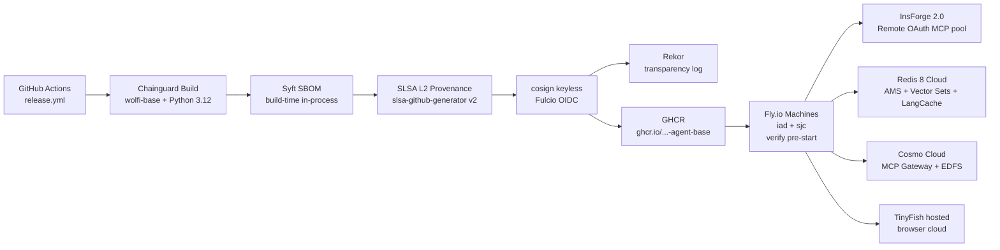

# Deployment

End-to-end walkthrough of how a commit to `main` becomes a running, signed, SLSA L2-verified agent on Fly.io. Mirrors architecture.md §12.



## 1. Build + sign (GitHub Actions)

Trigger: push to `main` or tag `v*`. Source: `infra/github-actions/release.yml`.

| Step | What runs | Why |
|---|---|---|
| checkout | `actions/checkout@v4` with `fetch-depth: 0` | SLSA materials need the full commit graph. |
| setup | `docker/setup-buildx-action@v3`, `sigstore/cosign-installer@v3`, `anchore/sbom-action/download-syft@v0` | Pinned tool versions (cosign v2.4.1, syft v1.18.1). |
| build | `docker build -f infra/chainguard/Dockerfile.wolfi` → tags `:${sha}` + `:latest` | Chainguard wolfi-base, Chromium shared libs via apk. |
| sbom | `syft $image -o spdx-json=sbom.spdx.json` | Build-time, NOT post-scan (architecture.md §13). |
| push | `docker push` both tags → GHCR | Public registry; public Rekor search works. |
| sign | `cosign sign --yes $image@$digest` | Keyless Fulcio — OIDC identity `https://github.com/nihalnihalani/understudy/.github/workflows/release.yml@refs/heads/main`. |
| slsa | `slsa-framework/slsa-github-generator/.github/workflows/generator_container_slsa3.yml@v2.0.0` | L2, not L3 — §18 risk #5. |
| attest | `cosign attest --yes --predicate sbom.spdx.json --type slsaprovenance` | In-toto predicate attached to digest. |
| rekor | `rekor-cli search --sha $digest` | Post-step reads back the transparency log UUID. |
| verify | `scripts/verify_release.sh` | Dry-run the stage demo inside CI — same command the presenter will type. |

## 2. Registry (GHCR + Rekor)

The image lives at `ghcr.io/nihalnihalani/understudy-agent-base:latest` (+ `:${sha}`). The Rekor log entry is queryable via `rekor-cli search --sha sha256:...`. Signatures and attestations attach to the **digest**, not the tag — any downstream consumer that wants reproducibility pins the digest.

## 3. Deploy (Fly Machines)

`infra/fly/fly.toml` deploys the synthesis API to **iad** + **sjc** on `performance-2x` VMs.

The pre-start hook is implemented as the process entrypoint:

```toml
[processes]
  api = "/usr/local/bin/fly-start.sh"
```

`fly-start.sh`:

```sh
cosign verify --certificate-identity "$COSIGN_CERT_IDENTITY" \
              --certificate-oidc-issuer "$COSIGN_CERT_OIDC_ISSUER" "$IMAGE_REF"
cosign verify-attestation --type slsaprovenance \
              --certificate-identity "$COSIGN_CERT_IDENTITY" \
              --certificate-oidc-issuer "$COSIGN_CERT_OIDC_ISSUER" "$IMAGE_REF"
exec python -m uvicorn apps.api.main:app --host 0.0.0.0 --port "$PORT"
```

If either verify exits non-zero, uvicorn never starts, the `http_checks` flatline, Fly marks the machine unhealthy, and the release is rejected. No silent failure path.

Per-agent machines are rendered from `infra/fly/agent.fly.toml.tmpl` by the synthesis worker, one machine per generated agent, image pinned by digest.

## 4. Browser runtime (TinyFish hosted cloud)

Generated agents **do not run browsers locally**. When the agent core loop needs to drive a browser, it shells out via `tinyfish run --skill {name}@{version} --script {path}` which calls TinyFish's hosted browser cloud over HTTPS. TinyFish owns the browser pool; we own the API key (`TINYFISH_API_KEY`, stored via `fly secrets set`).

No second runtime surface to operate, no launchd wrappers, no per-host pre-start verify outside of Fly.io. The cosign verify at Fly pre-start + the agent container's own `verify-self.sh` ENTRYPOINT are the complete verification surface.

## 5. Managed services

All three are external; no deploy step from this repo — we only wire credentials.

| Service | April 2026 surface | Reference |
|---|---|---|
| **InsForge 2.0** | Remote OAuth MCP pool (3 pre-provisioned slots) | `infra/insforge-pool/provision.sh` |
| **Redis 8** | Agent Memory Server + Vector Sets (int8) + LangCache | architecture.md §9 |
| **Cosmo Cloud** | MCP Gateway (Dream Query) + EDFS + federated router | architecture.md §4, §7 |

## 6. Pre-demo checklist

1. `./infra/insforge-pool/provision.sh` → 3 slots in `insforge:pool:available`.
2. `python scripts/prewarm_demo.py` → LangCache + AMS + Vector Sets + Dream Query cache warm.
3. `flyctl deploy --config infra/fly/fly.toml` → iad + sjc green.
4. `curl -sf https://api.tinyfish.ai/v1/health -H "Authorization: Bearer $TINYFISH_API_KEY"` → browser cloud reachable.
5. `scripts/verify_release.sh` from a clean shell → two green checks.

If step 5 fails, the pitch fails. Run it from the actual stage laptop before the session — Rekor + Fulcio are both internet-dependent.

## 7. Failure modes that touch deploy

(from architecture.md §13)

| Row | Where it lands in deploy |
|---|---|
| cosign verify fails | `fly-start.sh` / `agent/verify-self.sh` — both refuse to start. |
| InsForge MCP OAuth drift | `provision.sh` re-run refreshes slot credentials in Redis. |
| Chromium deps on distroless | We use wolfi-base + apk shared libs instead of pure distroless (see `Dockerfile.wolfi`). |
| Live Gemini >8s on stage | Hermetic demo mode via `DEMO_MODE=replay` (set on the Fly app). |

## 8. What we explicitly do NOT deploy

- Generated agents to Vercel Fluid Compute — does not admit headful-browser workloads.
- Cosign keys to prod — prod signing is keyless via Fulcio OIDC. Local dev keys are gitignored.
- A dynamic InsForge pool manager — 3 manual slots per §18 risk #3. Honest limit.
- SLSA L3 (hermetic builder) — out of scope for the hackathon per §18 risk #5.
